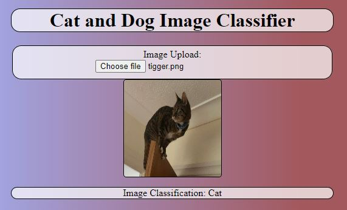

# fccCatAndDog

Cat and Dog Image Classifier

Image height & width needs to be 160 pixels

[Model link](https://drive.google.com/file/d/1ZYKbOzHPkz3Bq9pbASrr4ZuyJSjCuIFs/view?usp=sharing)



## Setup

- Download the model from [here](https://drive.google.com/file/d/1ZYKbOzHPkz3Bq9pbASrr4ZuyJSjCuIFs/view?usp=sharing)
- npm install

## Docker

Build with:

```bash
docker build -t fcccatanddog .
```

Run with:

```bash
docker run -dp 3000:3000 fcccatanddog
```
