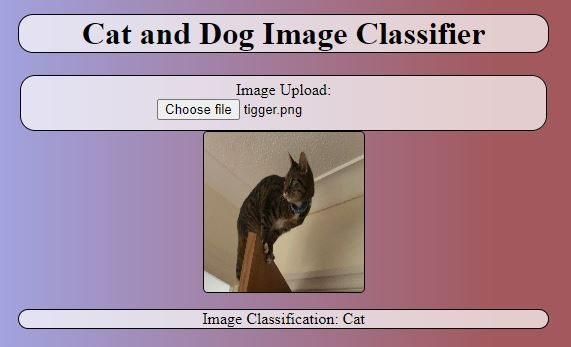

# fccCatAndDog

Cat and Dog Image Classifier

The final website is here: [catvdog.link477.com](https://catvdog.link477.com/)

Image height & width needs to be 160 pixels

[Model link](https://drive.google.com/file/d/1ZYKbOzHPkz3Bq9pbASrr4ZuyJSjCuIFs/view?usp=sharing)



## Setup

- Download the model from [here](https://drive.google.com/file/d/1ZYKbOzHPkz3Bq9pbASrr4ZuyJSjCuIFs/view?usp=sharing)
- npm install

## Docker

Build with:

```bash
docker build -t fcccatanddog .
```

Run with:

```bash
docker run -dp 3000:3000 fcccatanddog
```

## Build

Transpile TypeScript with

```bash
tsc --watch
```

Run prettier with

```bash
prettier . --write
```

Run babel with

```bash
npm run babel_me
```

Then delete the unneeded require calls.

## old dependancies

"@typescript-eslint/eslint-plugin": "^8.57.2",
"@typescript-eslint/parser": "^8.57.2",
"babel-jest": "^30.3.0",
"ts-jest": "^29.4.6",
