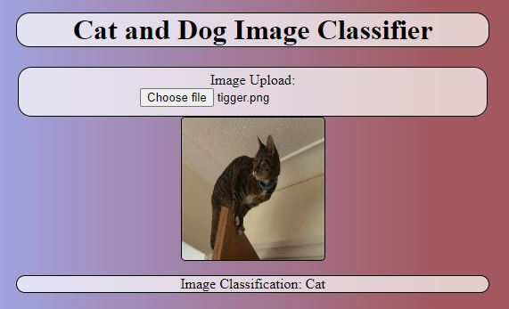

# fccCatAndDog

Cat and Dog Image Classifier

The final website is here: [catvdog.link477.com](https://catvdog.link477.com/)

Image height & width needs to be 160 pixels

[Model link](https://drive.google.com/file/d/1ZYKbOzHPkz3Bq9pbASrr4ZuyJSjCuIFs/view?usp=sharing)



## Setup

- Download the model from [here](https://drive.google.com/file/d/1ZYKbOzHPkz3Bq9pbASrr4ZuyJSjCuIFs/view?usp=sharing)
- npm install

## Docker

Build with:

```bash
docker build -t fcccatanddog .
```

Run with:

```bash
docker run -dp 3001:3001 fcccatanddog
```

## Build

Run prettier with

```bash
prettier . --write
```
